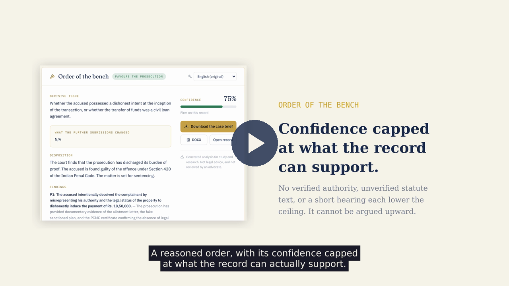
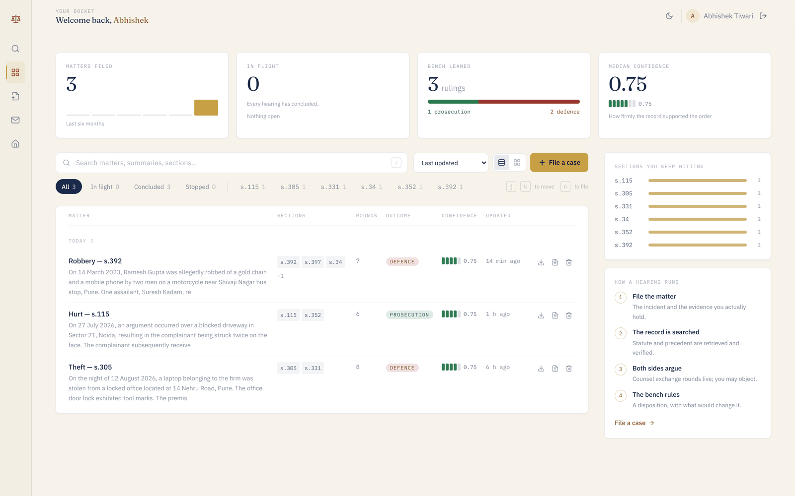
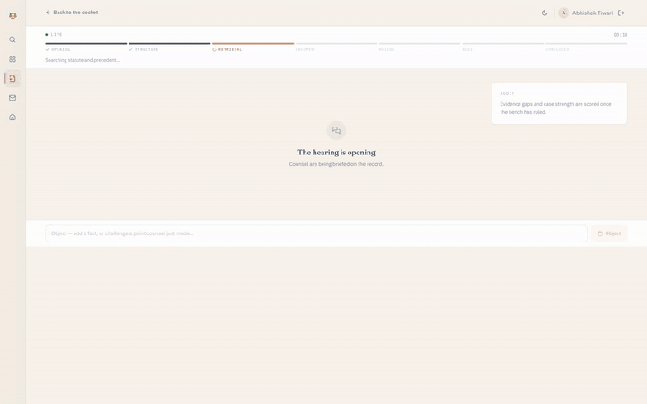
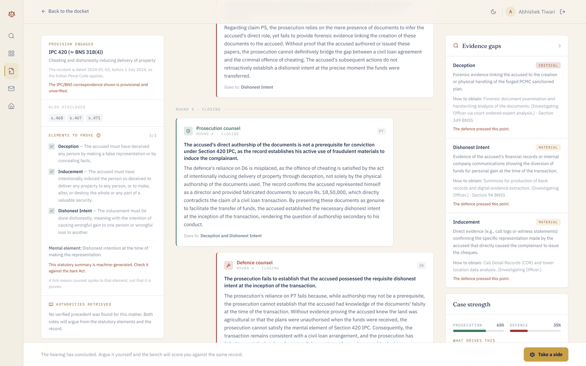
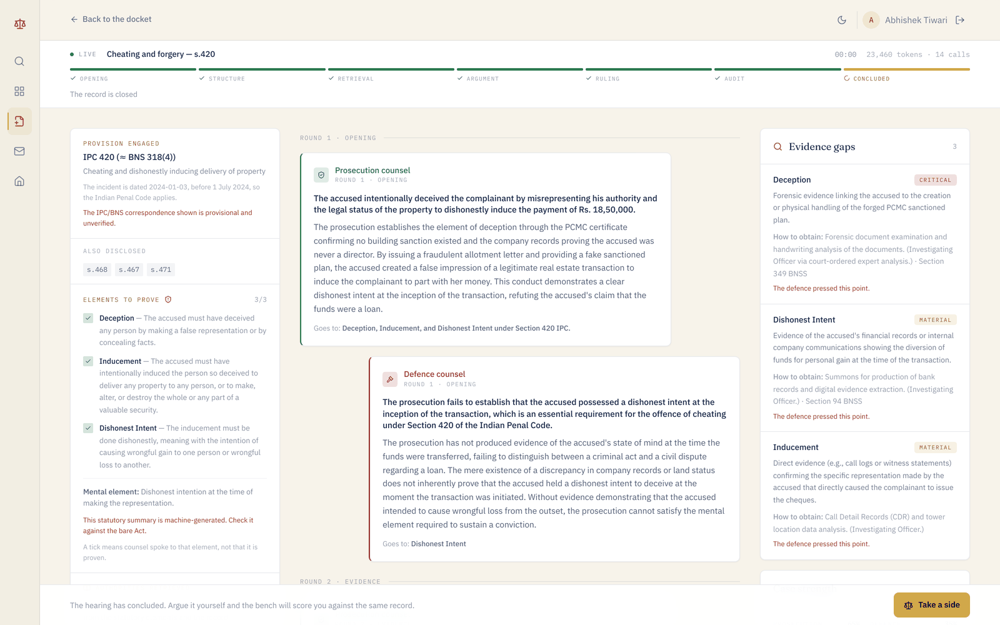
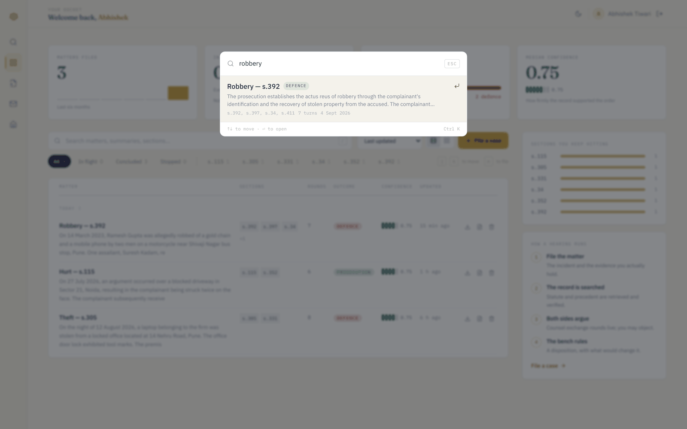
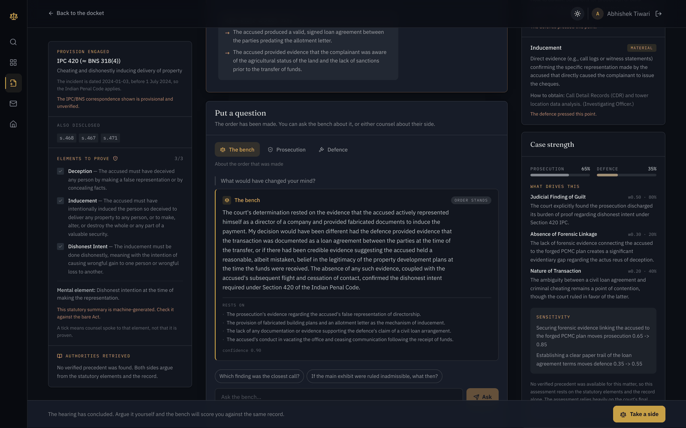

# VaadVivaad

**Adversarial legal analysis over Indian criminal law.** File a case — typed,
dictated, or as a document — and a structured hearing runs it: two AI counsel
argue it across opening, evidence, rebuttal and closing, every citation is
checked against verified authority *before* it reaches the transcript, and the
bench delivers a reasoned, confidence-capped order. Then the record is audited
for evidentiary gaps and case strength, and kept — searchable, resumable,
exportable.

It runs on free and self-hosted parts. **Google Gemini is the only external
account**, and several features exist specifically to make even that optional.

### Watch the launch film — 76 seconds

<video src="https://raw.githubusercontent.com/Abhi-shekes/Legal-AI-VaadVivaad/main/docs/media/vaadvivaad-launch.mp4" poster="https://raw.githubusercontent.com/Abhi-shekes/Legal-AI-VaadVivaad/main/docs/media/launch-poster.png" controls muted playsinline width="100%"></video>

<p align="center">
  <a href="https://raw.githubusercontent.com/Abhi-shekes/Legal-AI-VaadVivaad/main/docs/media/vaadvivaad-launch.mp4">
    
  </a>
  <br>
  <em>If the player above does not load, click the image — 76s, with sound and captions.</em>
</p>

---



<p align="center"><em>The Docket — every matter you have filed, which way the
bench leaned, and how firmly the record supported each order.</em></p>

### A hearing, running



Prosecution and defence argue in turn while the elements to prove tick off on
the left and evidence gaps accumulate on the right. You can object mid-hearing.



The provision engaged with its BNS counterpart, the elements checklist,
authorities retrieved — and gaps graded *critical* or *material* against the
record as it stands.

<table>
<tr>
<td width="50%"></td>
<td width="50%"></td>
</tr>
<tr>
<td><em>The order — findings resolved one by one, confidence capped at what the record supports.</em></td>
<td><em><code>⌘K</code> searches <strong>into</strong> the transcript, not just case titles.</em></td>
</tr>
<tr>
<td></td>
<td></td>
</tr>
<tr>
<td><em>Grafana, provisioned by the <code>observability</code> profile.</em></td>
<td><em>Dark theme throughout.</em></td>
</tr>
</table>

📖 **[The full walkthrough](docs/WALKTHROUGH.md)** — all 64 screenshots and
three screen recordings, covering every page and every feature.

🎬 **[Launch film storyboard](docs/AD-STORYBOARD.md)** — planned, not yet cut.

```
┌───────────────────────┐   HTTP + WS   ┌────────────────────────────┐
│  vaadvivaad-frontend   │ ────────────▶ │   vaadvivaad-backend        │
│  React 18 + Vite        │              │   FastAPI + Socket.IO       │
│  nginx (unprivileged)   │ ◀──────────── │   durable hearing machine   │
└───────────────────────┘   turns stream └──────────┬─────────────────┘
                                                     │
        ┌────────────────────┬───────────────────────┼───────────────────────┐
        ▼                    ▼                       ▼                       ▼
┌──────────────┐   ┌──────────────────┐   ┌──────────────────┐   ┌──────────────────┐
│ vaadvivaad-  │   │ vaadvivaad-qdrant │   │ vaadvivaad-redis  │   │  Google Gemini    │
│ mongo (7)     │   │ hybrid vector     │   │ sessions, limits, │   │  (external API)   │
│ users, cases, │   │ search: BM25 +    │   │ hearing state,    │   │  argument + the   │
│ transcripts   │   │ dense, RRF-fused  │   │ Socket.IO manager │   │  bench's reasoning│
└──────────────┘   └──────────────────┘   └──────────────────┘   └──────────────────┘
```

Five containers in the core stack. Extra capabilities — local embeddings, a
cross-encoder reranker, full-text record search, live web grounding, voice —
are **opt-in compose profiles** and are off until you ask for them.

## Quick start

```bash
cp .env.example .env
# Fill in every value. compose refuses to start with any of them blank —
# there are no insecure fallback defaults. At minimum you need:
#   JWT_SECRET_KEY        openssl rand -hex 32
#   MONGO_ROOT_PASSWORD   openssl rand -base64 24
#   QDRANT_API_KEY        openssl rand -hex 32
#   GOOGLE_API_KEY        a real Gemini key
docker compose up --build -d
```

- Frontend: http://localhost:8081
- Backend API: http://localhost:8000 — Swagger at `/docs`, health at `/health`,
  dependency-aware readiness at `/ready`, Prometheus text at `/metrics`
- Qdrant dashboard: http://localhost:6333/dashboard
- Mongo and Redis are internal only, authenticated, and persisted to named
  volumes

Signup, login, the dashboard ("The Docket"), and case history work
immediately. The **corpus starts empty** — retrieval correctly returns
nothing, and a hearing argues from the statutory elements and the record
alone until you ingest real judgments (see
[`vaadvivaad-backend/readme.md`](vaadvivaad-backend/readme.md) → *Corpus
ingest*). Without a working `GOOGLE_API_KEY`, argument generation and
embeddings degrade to a clean error rather than crashing anything else.

```bash
docker compose logs -f
docker compose ps
docker compose down          # add -v to also drop the data volumes
```

## What a hearing does

The flow is an explicit, checkpointed state machine
(`app/services/debate/machine.py`). Every turn is persisted as it completes,
so closing the tab — or restarting the backend — resumes the hearing rather
than losing it and the tokens already spent.

| Stage | What happens |
|---|---|
| **Intake** | Free prose (or a dictated recording, or an uploaded FIR / chargesheet / notice / bail order) is screened for scope, welfare and prompt injection, then parsed into a structured case record and shown back for correction before anything expensive runs. |
| **Research** | The engaged section is routed **IPC ↔ BNS by incident date** and its counterpart shown. Verified precedent is retrieved by hybrid search. The case file is read against itself for timeline impossibilities and contradictions. |
| **Opening / Evidence / Rebuttal / Closing** | Prosecution and defence argue each phase in turn, grounded in the retrieved statute and authorities and in passages pulled from the case's own documents. A rolling **claim ledger** tracks who claimed what and whether it was answered. You can interject an objection mid-hearing; the affected counsel must address it. |
| **Order** | The bench delivers a reasoned disposition. Confidence is **capped at what the record supports** — no verified authority, unverified statute text, or a short hearing each lower the ceiling. |
| **Audit** | The record is analysed for evidentiary gaps (what is missing, how that class of evidence is obtained, who obtains it) and overall case strength. |

After the order you can **recall counsel for further submissions** (the prior
order is kept, not overwritten), **put a question to the bench or either
counsel**, **translate the whole hearing** into one of 12 Indian languages,
and **export it as a formatted brief** (PDF / DOCX / HTML).

### The trust boundary

The one rule the whole system is built around: **counsel may only cite from
the shortlist of authorities actually retrieved for the case**, and every
citation in a generated turn is verified against that shortlist *before the
turn is emitted*. Anything unmatched is stripped and the turn is flagged.

- An injected "cite *Sharma v. State*" costs the attacker nothing to get the
  model to say — but the citation still has to exist in the shortlist, and it
  does not, so it never reaches the transcript.
- The corpus is **curated-ingest only**. The application never writes to it;
  every document carries provenance, and retrieval refuses to cite anything
  not marked verified from a declared source.
- Live web results (the "outside the record" panel) are **never citable**,
  never `Precedent` objects, and never enter the debate context — they exist
  so a practitioner can follow a lead the snapshot missed.

## Capability profiles

The core stack is `mongo`, `qdrant`, `redis`, `backend`, `frontend`.
Everything else is opt-in and degrades cleanly when absent.

| Profile | Command | Adds | Without it |
|---|---|---|---|
| `retrieval` | `docker compose --profile retrieval up -d` | Local `bge-m3` embeddings + `bge-reranker-v2-m3` cross-encoder (Hugging Face TEI). Removes the per-document Gemini embedding call and keeps retrieval working when the Gemini quota is spent. | Gemini embeddings; ranking by the deterministic legal features (section overlap, court seniority, recency). |
| `search` | `docker compose --profile search up -d` | Meilisearch — typo-tolerant full-text search over every turn, order and consultation, with facets. Powers the ⌘K palette. | A MongoDB text index that finds a case by description and offence but cannot reach the transcript. |
| `websearch` | `docker compose --profile websearch up -d` | SearXNG — the "outside the record" panel, restricted to an allowlist of official publishers. The only container that talks to the open internet. | The panel reports unavailable. |
| `voice` | `docker compose --profile voice up -d` | Whisper (dictate the matter) + Piper (hear the hearing, one voice per persona). Independent — either can run alone. | The textarea is the only input. |
| `tls` | `docker compose --profile tls up -d` | Caddy — automatic Let's Encrypt certificates, no cloud load balancer. | Put your own TLS-terminating proxy in front and set `COOKIE_SECURE=true`. |
| `observability` | `docker compose --profile observability up -d` | Prometheus + Grafana against `/metrics`. | `/metrics` is still exposed; scrape it with anything. |

See [`ops/README.md`](ops/README.md) for TLS, metrics, secrets and backups.

## Configuration

Every variable is documented inline in [`.env.example`](.env.example).
Highlights:

| Variable | Required | Purpose |
|---|---|---|
| `JWT_SECRET_KEY` | **Yes** | Signs sessions. Must be ≥ 32 chars; compose and the app both refuse to start without it. |
| `MONGO_ROOT_USERNAME` / `MONGO_ROOT_PASSWORD` | **Yes** | Mongo runs authenticated; the backend connects with `authSource=admin`. |
| `QDRANT_API_KEY` | **Yes** | Locks Qdrant's REST/dashboard port and the backend's access to it. |
| `GOOGLE_API_KEY` | **Yes** | Gemini — argument generation and (by default) embeddings. Endpoints degrade to a clean error without a working key. |
| `GEMINI_MODEL_FAST` / `GEMINI_MODEL_REASONING` | No | Two tiers, both `gemini-flash-lite-latest` by default (the only tier whose free quota can carry a whole hearing). Point the reasoning tier at a stronger model if you have paid quota — no code change. |
| `DEBATE_TOKEN_BUDGET` / `DEBATE_MAX_ROUNDS` | No | Hard ceiling per hearing; it aborts rather than run away with your quota, keeping the transcript so far. |
| `RATELIMIT_DEBATE` / `RATELIMIT_AUTH` / `RATELIMIT_API` | No | Per-user / per-IP budgets. Debates get their own. |
| `EMBEDDING_PROVIDER` / `EMBEDDING_DIMENSIONS` | No | `gemini` (768-d) or `local` (bge-m3, 1024-d). Changing provider changes the vector width — re-ingest with `--recreate`. |
| `HYBRID_SEARCH` | No | BM25 sparse vector fused with the dense one by reciprocal rank. On by default; silently dense-only if `fastembed` is unavailable. |
| `COOKIE_SECURE` | No | `true` once served over HTTPS. |
| `PUBLIC_API_URL` / `PUBLIC_SOCKET_URL` | No | Baked into the frontend build — must be reachable from the **browser**, not just the Docker network. |

## Project layout

```
Legal-AI-VaadVivaad/
├── docker-compose.yml          Core stack + capability profiles
├── docker-compose.dev.yml      Hot-reload dev overlay (dev.sh)
├── .env.example                Every variable, documented inline
├── ops/                        Caddyfile, Prometheus, SearXNG settings, runbook
├── .github/workflows/ci.yml    Backend tests, frontend build, compose validation
├── vaadvivaad-backend/         FastAPI + Socket.IO API          → see its readme
└── vaadvivaad-frontend/        React + Vite SPA                  → see its README
```

One repository. `vaadvivaad-backend/` and `vaadvivaad-frontend/` each keep
their own README covering standalone (non-Docker) setup, and their own
`.gitignore`, `Dockerfile` and dependency manifest — they are still built and
released as separate images, they are just versioned together.

## Security posture

- **Both app containers run as non-root** — the backend as a dedicated
  `vaadvivaad` user, the frontend on `nginx-unprivileged` (port 8080, no root
  process).
- **Authentication everywhere.** Every case route and the Socket.IO handshake
  validate a JWT; the case id is a server-minted opaque uuid, so a room can't
  be enumerated to watch someone else's hearing. Short access token + rotating
  refresh token; logout actually revokes the session.
- **Mongo authenticated**, Qdrant behind an API key, Redis on the internal
  network only.
- **No insecure fallback values** — compose interpolation (`${VAR:?...}`) and
  a Pydantic validator both hard-fail on a missing or weak secret.
- **Prompt-injection defence in depth** — user text is fenced, generated
  output is run through an injection canary, and the citation check makes a
  persuaded model harmless.
- **nginx**: gzip, `X-Content-Type-Options`, `X-Frame-Options`,
  `Referrer-Policy`, `server_tokens off`, long-cache hashed assets vs.
  `no-cache` on `index.html`.
- Named containers/network/volumes, healthchecks gating startup order,
  resource limits and rotated JSON logging on every service, `.dockerignore`
  so secrets / `.git` / `node_modules` never enter an image layer.

## Not legal advice

VaadVivaad simulates how a matter might be argued. It is a research and
drafting aid, not a substitute for a licensed advocate, and every section
number and authority it produces must be checked against the official text
before any use.
